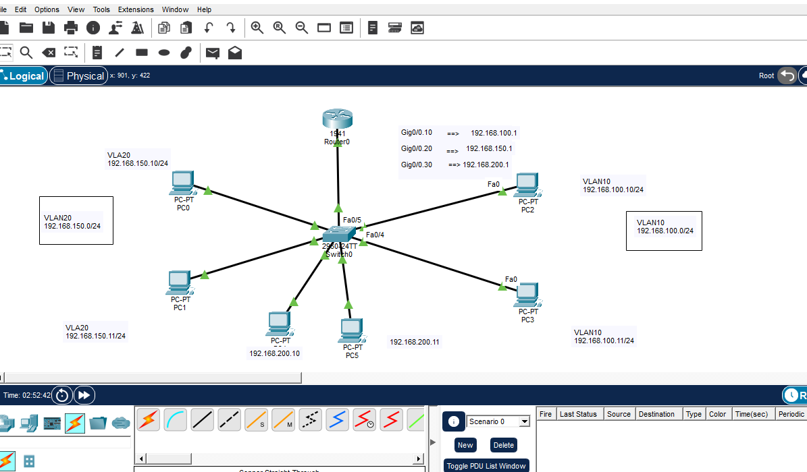

# CCNA Router-on-a-Stick (ROAS) Inter-VLAN Routing Lab

## 📌 Project Overview

This repository contains a Cisco Packet Tracer laboratory demonstrating **Router-on-a-Stick (ROAS)** Inter-VLAN Routing.

The lab shows how multiple VLANs can communicate through a **single physical router interface** using **IEEE 802.1Q trunking** and **router sub-interfaces**. It also demonstrates proper **Native VLAN (VLAN 199)** configuration and verification.

---

## 🎯 Learning Objectives

By completing this lab, you will learn how to:

* Configure VLANs on a Cisco switch.
* Configure IEEE 802.1Q trunking.
* Configure Router-on-a-Stick (ROAS).
* Configure router sub-interfaces.
* Configure a Native VLAN.
* Verify Inter-VLAN Routing.
* Troubleshoot common ROAS issues.

---

## 🏗️ Why Router-on-a-Stick?

Router-on-a-Stick (ROAS) is a scalable alternative to Traditional Inter-VLAN Routing.

Instead of requiring one physical router interface per VLAN, ROAS uses a **single trunk link** carrying traffic for multiple VLANs. The router separates this traffic using **802.1Q sub-interfaces**, significantly reducing hardware requirements.

---

## 🌐 Network Topology



---

## 📋 Network Addressing

| Device  | Interface | IP Address     | VLAN              |
| ------- | --------- | -------------- | ----------------- |
| Router0 | G0/0.10   | 192.168.100.1  | VLAN 10 (Sales)   |
| Router0 | G0/0.20   | 192.168.150.1  | VLAN 20 (HR)      |
| Router0 | G0/0.30   | 192.168.200.1  | VLAN 199 (Native) |
| PC2     | Fa0       | 192.168.100.10 | VLAN 10           |
| PC3     | Fa0       | 192.168.100.11 | VLAN 10           |
| PC0     | Fa0       | 192.168.150.10 | VLAN 20           |
| PC1     | Fa0       | 192.168.150.11 | VLAN 20           |
| PC4     | Fa0       | 192.168.200.10 | VLAN 199          |
| PC5     | Fa0       | 192.168.200.11 | VLAN 199          |

---

# 🛠️ Switch Configuration

### VLAN Creation

```ios
vlan 10
 name Sales

vlan 20
 name HR

vlan 199
 name Native
```

### Access Ports

```ios
interface range fa0/4-5
 switchport mode access
 switchport access vlan 10

interface range fa0/1-2
 switchport mode access
 switchport access vlan 20

interface range fa0/6-7
 switchport mode access
 switchport access vlan 199
```

### Trunk Port

```ios
interface fa0/3
 switchport mode trunk
 switchport trunk native vlan 199
```

---

# 🛠️ Router Configuration

Enable the physical interface.

```ios
interface GigabitEthernet0/0
 no shutdown
```

### VLAN 10

```ios
interface GigabitEthernet0/0.10
 encapsulation dot1Q 10
 ip address 192.168.100.1 255.255.255.0
```

### VLAN 20

```ios
interface GigabitEthernet0/0.20
 encapsulation dot1Q 20
 ip address 192.168.150.1 255.255.255.0
```

### Native VLAN

```ios
interface GigabitEthernet0/0.30
 encapsulation dot1Q 199 native
 ip address 192.168.200.1 255.255.255.0
```

---

# 🔄 Traffic Flow Analysis

When **PC2 (VLAN 10)** sends traffic to **PC0 (VLAN 20)**:

1. PC2 determines that the destination belongs to another subnet.
2. PC2 forwards the packet to its Default Gateway.
3. The switch tags the frame with **802.1Q VLAN 10**.
4. The router receives the tagged frame on G0/0.
5. Sub-interface G0/0.10 processes the packet.
6. The router routes the packet to sub-interface G0/0.20.
7. The frame is re-tagged as VLAN 20.
8. The switch removes the tag before delivering the frame to PC0.

---

# 🔍 Verification

### Switch

```text
show vlan brief
show interfaces trunk
```

### Router

```text
show ip interface brief
show ip route
show running-config
```

---

# 🧪 Connectivity Test

```bash
ping 192.168.150.10
```

Expected Result:

* The first ping may timeout because of ARP.
* All subsequent replies should succeed.

---

# 📊 Screenshots

Include screenshots showing:

* Network Topology
* show vlan brief
* show interfaces trunk
* show ip route
* Successful Ping
* Packet Tracer Simulation Mode

---

# 🚀 Key Takeaways

* One physical router interface supports multiple VLANs.
* IEEE 802.1Q provides VLAN tagging.
* Native VLAN traffic is transmitted untagged.
* Router sub-interfaces enable Layer 3 routing between VLANs.
* ROAS is significantly more scalable than Traditional Inter-VLAN Routing.

---
## 🏷️ Understanding Tagged vs. Untagged Traffic in this Lab

To fully grasp how Inter-VLAN routing operates in this topology, we must differentiate between how Access ports and Trunk ports handle Ethernet frames:

### 1. Untagged Frames (Access Ports & End Devices)
* **What it means:** Standard end devices (like PC0, PC2, PC4) have no concept of VLANs. They send and receive standard, **Untagged** Ethernet frames.
* **In this Lab:** * When **PC2** sends data, it leaves the PC interface as *Untagged*. 
  * **Switch0** receives it on `Fa0/4` (Access VLAN 10), and internally understands that this frame belongs to the Sales department. 
  * Before delivering data to any target PC on an access port, the switch strips away any internal tracking, ensuring the final PC receives a clean, *Untagged* frame.

### 2. Tagged Frames (Trunk Port `Fa0/3`)
* **What it means:** To multiplex multiple networks over the single physical link between **Switch0** and **Router0**, frames must be "labeled" so the receiving device knows which VLAN they belong to. This is called **802.1Q Tagging**.
* **In this Lab:**
  * When the switch forwards PC2's frame up to the router via the Trunk port `Fa0/3`, it injects a **4-byte 802.1Q Tag** containing **VLAN ID: 10** into the Ethernet header.
  * **Router0** receives this **Tagged Frame** on its physical interface, reads the tag, and steers it directly to the virtual sub-interface `Gig0/0.10`.

### 3. The Native VLAN Exception (VLAN 199)
* **The Rule:** The Native VLAN is the *only* VLAN on a trunk link that sends and expects traffic **Untagged**.
* **In this Lab:** * **PC4** and **PC5** are administrative devices assigned to **VLAN 199**.
  * When their traffic travels across the trunk line `Fa0/3` toward the router, **Switch0 does NOT add an 802.1Q tag** because it matches the configured Native VLAN.
  * **Router0** receives this *Untagged* frame on its physical port, recognizes it as Native traffic, and processes it through sub-interface `Gig0/0.30` (configured with `encapsulation dot1Q 199 native`).

# ⚠️ Design Considerations

Although Router-on-a-Stick greatly reduces hardware requirements, all VLAN traffic traverses a single trunk link. As network traffic grows, this trunk can become a bottleneck. Modern enterprise networks often replace ROAS with Layer 3 switches that perform Inter-VLAN Routing directly in hardware.

---

# 📂 Repository Structure

```text
Router-on-a-Stick-Inter-VLAN-Routing/
│
├── README.md
├── Router-on-a-Stick.pkt
├── topology.png
└── screenshots/
    ├── show-vlan-brief.png
    ├── show-interfaces-trunk.png
    ├── show-ip-route.png
    ├── ping-success.png
    └── simulation-mode.png
```

---

# 👩‍💻 About This Project

This project was developed as part of my CCNA learning journey and technical portfolio.

It demonstrates practical experience with IEEE 802.1Q trunking, Router-on-a-Stick (ROAS), Native VLAN configuration, router sub-interfaces, and Inter-VLAN Routing while reinforcing the networking concepts required for enterprise network design.
